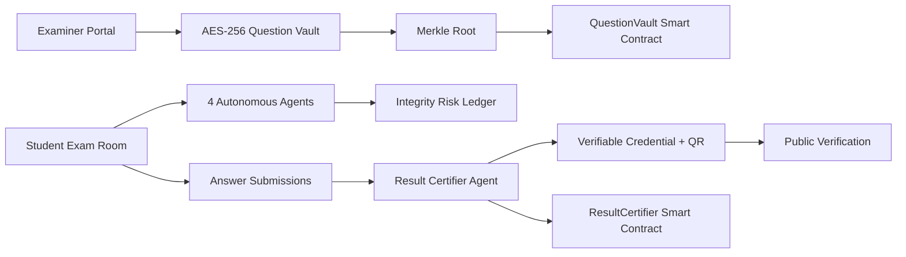

# ExamChain

Zero-trust examination infrastructure for the FAR AWAY hackathon.

ExamChain prevents paper leaks and result tampering by combining encrypted question vaults, threshold-key release, autonomous integrity agents, behavioral/environment monitoring, and blockchain-backed verifiable credentials.

## What Judges Can Demo

- Examiner creates an exam, uploads encrypted questions, and locks the Merkle root on-chain.
- Student enters an exam room with adaptive question flow and live risk telemetry.
- Browser/environment events are scored by an autonomous auditor.
- Result certifier issues a W3C-style verifiable credential with a public verification URL.
- Admin dashboard shows chain status, agent events, integrity flags, and recent transactions.

The frontend also includes a polished no-backend demo path at `/exam/demo-neet-2026`, so reviewers can evaluate the product experience even before running Postgres, Redis, and Ganache.

## Architecture



## Tech Stack

- Frontend: React, Vite, Zustand, Axios, Recharts, qrcode.react
- Backend: FastAPI, SQLAlchemy async, PostgreSQL, Redis
- Security: AES-256-GCM, Merkle proofs, DID-style identifiers, JWT auth
- Blockchain: Solidity, Hardhat, Ganache, Web3.py
- Agents: integrity monitor, adaptive selector, environment auditor, result certifier

## Local Setup

1. Start infrastructure:

```bash
docker compose up -d postgres redis
```

2. Start Ganache on port `8545`, then deploy contracts:

```bash
cd contracts
npm install
npx hardhat compile
npx hardhat run scripts/deploy.js --network localhost
```

3. Start backend:

```bash
cd backend
python3 -m venv venv
source venv/bin/activate
pip install -r requirements.txt
uvicorn main:app --reload --port 8000
```

4. Start frontend:

```bash
cd frontend
npm install
npm run dev
```

Open `http://localhost:5173`.

## Submission Notes

- Public GitHub repository: submit the repo URL.
- PPT upload: use `submission/ExamChain_FAR_AWAY_Submission.pptx`.
- Optional live URL: deploy the `frontend` folder to Vercel/Netlify. The demo route works without backend services.

## Demo Script

1. Open landing page and state the problem: high-stakes exam trust fails when any one insider can access paper, scoring, or results.
2. Open Examiner Portal: create exam, upload encrypted questions, lock to chain.
3. Open Admin Dashboard: show Merkle root, chain status, agent feed, and integrity flags.
4. Open `/exam/demo-neet-2026`: answer questions while the environment auditor and integrity monitor update.
5. Submit exam: show result credential, VC hash, chain transaction, and QR verification.
6. Open Verify Credential: prove that the result can be checked publicly without trusting a central database.

## Why It Can Win

ExamChain is not a generic quiz app. It attacks the full examination trust chain: paper creation, timed release, live proctoring, adaptive exam flow, tamper-proof scoring, and portable result proof.
