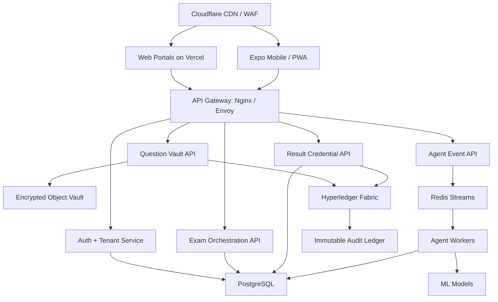

# ExamChain Production Roadmap

ExamChain should evolve from a hackathon demo into examination infrastructure: a secure, multi-tenant platform that institutions can use to create, deliver, monitor, certify, and audit high-stakes exams.

## Product Thesis

Most exam software is built like a quiz app. ExamChain should be built like critical infrastructure.

The defensible product is not only online testing. It is the trust layer around exams:

- Question creation and encrypted vaulting
- Timed release and multi-party approval
- Live integrity monitoring
- Adaptive question delivery
- Offline-center answer capture and sync
- Tamper-evident scoring
- Public result verification
- Institution-grade audit and compliance

## Corrected Free-First Strategy

“Free to build” and “free to run national-scale production” are different.

Use free tiers and open-source tooling for development, demos, pilots, and small colleges. For real high-stakes exam bodies, the architecture must support paid managed infrastructure or institution-owned deployment.

### Free To Build / Pilot Stack

| Layer | Recommended free-first choice | Why |
| --- | --- | --- |
| Frontend web | React + Vite on Vercel Hobby | Already working; fast free deployment |
| Mobile app | Expo React Native | Free local dev; Android-first reach |
| API | FastAPI on Render free or Fly.io free allowance when available | Low-cost prototype hosting |
| Database | Supabase free Postgres for PoC | Managed Postgres without server work |
| Cache/queue | Upstash Redis free or self-hosted Redis | Works for sessions, rate limits, pub/sub |
| Object storage | MinIO local/self-hosted | S3-compatible encrypted question vault |
| Blockchain for PoC | Hyperledger Fabric local Docker network | No gas fees; enterprise-grade model |
| CI/CD | GitHub Actions free for public repos | Build, lint, tests, security scan |
| WAF/CDN | Cloudflare free plan | CDN, DNS, baseline DDoS protection |
| Secrets dev | Doppler free or `.env` only locally | Safer than committing secrets |
| Security scan | OWASP ZAP + Semgrep community | Free automated security checks |

### Production Stack

| Layer | Production target | Notes |
| --- | --- | --- |
| Edge | Cloudflare WAF + CDN + bot controls | Put all portals and APIs behind edge protection |
| API gateway | Nginx or Envoy in front of FastAPI | Rate limits, request size limits, mTLS internally |
| Backend | FastAPI services split by domain | Auth, exam, vault, agent, credential, admin |
| Workers | Celery/RQ + Redis Streams | Agent jobs, scoring, media analysis, certificates |
| Database | PostgreSQL 16 + read replicas + PITR | Tenant partitioning first, sharding later |
| Cache | Redis 7 cluster or managed Redis | Sessions, queues, realtime fan-out |
| Object vault | MinIO or S3-compatible storage | Envelope encryption per exam |
| Ledger | Hyperledger Fabric 2.5 | Permissioned channels per tenant/institution |
| Identity | did:web + W3C VC + OIDC4VP | Public verification without exposing answer data |
| Secrets | HashiCorp Vault + SoftHSM2 | Key rotation, signing keys, threshold ceremony |
| Observability | OpenTelemetry + Prometheus + Grafana + Loki | Traces, metrics, logs, audit evidence |

## Why Hyperledger Fabric Over Public Ethereum

Use Hyperledger Fabric for the serious version.

Reasons:

- Permissioned network fits government/university trust boundaries.
- Private channels support tenant isolation.
- No gas fees and no public exposure of exam metadata.
- Chaincode can model exam lifecycle policies directly.
- Fabric CA supports institution and operator identity.

Keep EVM/Polygon as an optional public proof anchoring layer later, not the core system.

## Target Architecture

## Multi-Tenant Model

Every customer is a tenant.

Tenant isolation should exist at four levels:

- Application: tenant-aware auth, RBAC, and branding
- Database: tenant_id on every row, PostgreSQL row-level security later
- Storage: tenant/exam-scoped encrypted buckets or prefixes
- Ledger: Fabric channel or private data collection per large tenant

Example tenants:

- University
- State public service commission
- Corporate assessment provider
- Coaching institute
- National exam authority

## Security Architecture

### Question Vault

- AES-256-GCM for question payloads
- Envelope encryption per exam
- Key encryption key stored in Vault or HSM
- Shamir 3-of-5 ceremony for high-stakes release approval
- Merkle root committed before exam start
- Every question version hashed and signed

### Session Security

- Short-lived access tokens: 15 minutes
- Refresh token rotation
- Device binding and browser fingerprinting
- IP/device anomaly detection
- WebAuthn/passkeys for examiners and admins
- Rate limits at Cloudflare and Nginx

### Result Security

- Result hash generated from canonical score payload
- DID assigned to candidate result identity
- W3C-style verifiable credential signed by institution key
- Fabric transaction stores credential fingerprint, not private student data
- Public verifier checks DID + exam ID + credential hash

### Audit

Every sensitive action should generate an audit event:

- Login
- Question upload
- Question edit
- Exam lock
- Key release approval
- Student session start
- Browser anomaly
- Score calculation
- Result issuance
- Credential verification

Audit events should be append-only in Postgres and periodically anchored to Fabric.

## AI Agent Roadmap

### Agent 1: Integrity Monitor

Current: simple event stream and risk flags.

Production:

- Graph-based cheat ring detection
- Timing correlation
- Answer-order similarity
- Center-level anomaly detection
- Human review queue with evidence bundles

Free tools:

- PyTorch
- PyTorch Geometric
- scikit-learn

### Agent 2: Adaptive Selector

Current: demo adaptive question flow.

Production:

- Item Response Theory
- Bayesian ability estimate
- Exposure control so one question does not over-appear
- Question bank health metrics

Free tools:

- NumPy
- SciPy
- PyMC optional

### Agent 3: Environment Auditor

Current: event-based proctoring demo.

Production:

- Face presence and liveness
- Multiple-face detection
- Screen-focus monitoring
- Audio event detection for suspicious speech
- Offline-center camera snapshots with delayed sync

Free tools:

- OpenCV
- InsightFace
- YOLOv8/YOLO11 open-source models where license fits
- Whisper-compatible open-source speech models

### Agent 4: Result Certifier

Current: credential issuer.

Production:

- Deterministic scoring pipeline
- Manual override workflow with reason codes
- Result freeze and release windows
- Credential revocation registry

### Agent 5: Question Quality Analyzer

New production agent:

- Flags too easy, too hard, ambiguous, or low-discrimination questions
- Tracks post-exam item statistics
- Suggests question bank retirement
- Helps institutions improve future exams

## Offline Exam Center Mode

Many real exam centers cannot depend on perfect internet.

Design:

- Local center appliance or laptop runs a signed ExamChain Center Node.
- Question bundles are preloaded encrypted.
- Release key arrives at start window.
- Answers are stored locally in encrypted IndexedDB or local Postgres.
- Center syncs events and answers when internet returns.
- Conflict-free sync validates signatures and monotonic event order.

Free implementation path:

- PWA + IndexedDB for browser clients
- Local FastAPI center server
- SQLite/Postgres local cache
- Tailscale free for secure pilot networking

## Compliance Roadmap

India-focused readiness:

- DPDP Act principles: data minimization, consent/purpose, retention policy, breach process
- Data localization option for government customers
- Role-based access control
- Audit export for institutions
- Student data deletion/anonymization workflows
- WCAG 2.1 AA accessibility
- ISO 27001 readiness documents

## Source Links

- Hyperledger Fabric docs: https://hyperledger-fabric.readthedocs.io/
- Supabase pricing: https://supabase.com/pricing
- Vercel pricing: https://vercel.com/pricing
- Render free plan docs: https://render.com/docs/free
- Upstash pricing: https://upstash.com/pricing
- Cloudflare plans: https://www.cloudflare.com/plans/
- MinIO docs: https://min.io/docs/minio/container/index.html
- HashiCorp Vault: https://developer.hashicorp.com/vault/docs
- OWASP ZAP: https://www.zaproxy.org/
- W3C Verifiable Credentials: https://www.w3.org/TR/vc-data-model-2.0/
